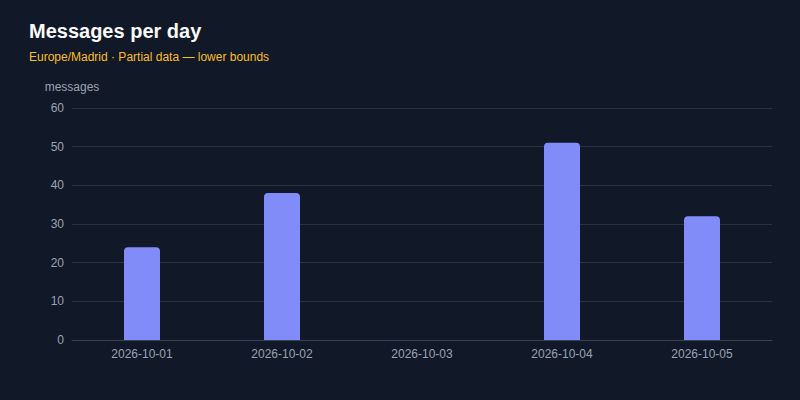

# Личный аккаунт: как пользоваться

`max` позволяет вам или вашему ИИ-агенту читать и писать в свой личный аккаунт MAX из терминала. Эта
страница — обзор: от входа до чтения, отправки и групп, в том порядке, в каком это понадобится.
Откройте её, когда начинаете работать с `max`, или когда хотите знать, что возможно, прежде чем просить
агента. Бот, который работает через официальный Bot API, описан на странице [бот](bot.md).

Прочитав её, вы будете знать, как назвать чат, как читать и искать так, чтобы никто не увидел, что вы
смотрели, как безопасно отправлять и как получать ответы, которые может разобрать скрипт. Каждая
команда и опция — в [справочнике команд](commands.md), он собирается из самой программы; эта страница
объясняет, как они складываются вместе.

Термины этой страницы:

- **Профиль** — один аккаунт MAX, настроенный на этом компьютере, со своим входом и настройками. Его
  выбирает первое слово команды ([профиль](#профиль--первое-слово)).
- **Чат** — любая переписка: личный чат, группа, канал или «Избранное».
- **Локальная копия** — база на этом компьютере, где `max` хранит каждое прочитанное сообщение
  ([локальная копия](archive.md)).
- **Проверки отправки** — то, через что проходит каждая отправка: профиль только для чтения, список
  разрешённых получателей и лимит в час ([безопасность](security.md)).
- **`max serve`** — фоновый процесс, который держит одно подключение к MAX для всех команд профиля.

Каждая команда делает одно дело, печатает результат и завершается. Подключение к MAX держит
только [`max serve`](archive.md#новые-сообщения-сразу-max-serve-и-max-watch): его запускает в фоне первая
команда, которой нужен MAX, и он сам останавливается через 15 минут без дела.

```sh
max [профиль] [опции] <ресурс> <действие> [аргументы]
```

## Что можно сделать

| Область | Что можно | С чего начать |
|---|---|---|
| Чтение | чаты, сообщения, одно сообщение и соседние | `max chats list`, `max messages list <чат>` |
| Что ждёт ответа | непрочитанное от других; что вы обещали и что открыто | `max inbox`, `max review` |
| Голосовые | превратить голосовое в текст, на этом компьютере | `max messages transcribe` |
| Файлы | скачать вложения сообщения или всего чата; медиа чата | `max messages download`, `max chats media` |
| Люди | контакты, свои имена и заметки, профиль человека, проверка на бота | `max contacts list`, `max contacts profile` |
| Поиск | сообщения, файлы, даты, люди; обсуждения по смыслу | `max search messages`, `max search conversations` |
| Отправка | текст, файлы, голосовые, ответы, отложенные сообщения | `max messages send` |
| Изменение | правка, пересылка, закрепление, удаление, реакции, опросы, отметка прочитанным | `max messages edit`, `max reactions add` |
| Боты | нажать кнопку бота, запустить бота, открыть мини-приложение | `max messages press`, `max chats start` |
| Порядок | папки, звук чатов, приватность | `max chats folders list`, `max chats mute` |
| Группы | участники, ссылки-приглашения, заявки, админы, правила модерации | `max chats members list`, `max chats rules show` |
| Слежение | новые сообщения по мере прихода; свежая локальная копия | `max watch`, `max serve` |
| Проверка | что делала команда; что профилю можно | `max runs list`, `max config show` |

## Прочитайте чат с агентом

После подключения аккаунта попросите короткий итог переписки. Эта задача читает сообщения и ничего
не отправляет.

**Ваш запрос:**

> Подведи итог пяти последних сообщений Книжный клуб. Покажи решения и открытые вопросы. Ничего не отправляй.

**Команда:**

```sh
max messages list "Книжный клуб" --limit 5 --json
```

**Пример ответа агента:**

> **Решили:** следующая встреча в четверг в 18:00.
>
> **Открыто:** где встречаться.
>
> Могу показать сообщения, на которых основан итог. Ничего не отправлено.

Итог выше вымышлен. Попросите открыть исходные сообщения, прежде чем полагаться на интерпретацию
агента. Настройка, действия с сообщениями и разрешения объясняются в разделах ниже.

## Начало работы

```sh
max setup --agent codex  # QR-вход и навык агента
```

```sh
max chats list           # ваши чаты
```

Настройка может занять около пяти минут. Команда проверяет до пяти чатов и не запускает
фоновый сервис. История скачивается отдельно после выбора чата и объёма. Агент перед входом
читает `max skill show`, доступный без сессии.
`max skill show link-conversations` печатает общий навык связывания разговоров из архива;
дополнительный вход для этого не нужен.

## Вход

Первый запуск — `max setup`. Для явного повторного входа — `max session start qr`: в терминале
появится QR-код, вы отсканируете его приложением MAX, и токен ляжет в ключницу. Все способы входа —
[вход, сессии и профили](sessions.md). Без способа `max session start` **импортирует токен**,
полученный в официальном клиенте, и кладёт его в ключницу операционной системы.

```sh
max session start
MAX token: ▏               # ввод не отображается
```

**Токен не передаётся аргументом**: аргумент виден в `ps` любому процессу на машине и остаётся в
истории оболочки. Поэтому он либо спрашивается у терминала без эха, либо читается из трубы:

```sh
pass show max/token | max session start
```

Для CI и разовых запусков есть `MAX_TOKEN` — он старше ключницы, то есть если переменная задана,
берётся она:

```sh
MAX_TOKEN="$(cat /path/to/token)" max chats list
```

Проверить, кто вы:

```sh
max account show                # номер телефона — только последние 4 цифры
```

```sh
max account show --show-phone   # номер целиком
```

```sh
max account list                # все профили на этом компьютере и аккаунт каждого; в MAX не обращается
```

```sh
max account sessions list       # где ещё выполнен вход
```

Выйти из MAX и забыть сессию на этой машине:

```sh
max session end
```

`session end` завершает сессию на сервере MAX (`revokedOnServer: true`). Если токен был скопирован
из вкладки web.max.ru, вкладка тоже выйдет.

`account show --json` содержит поля MAX `id`, `name`, `phone`, `description` и `username: null`, как
общий формат аккаунта. Номер маскируется; `--show-phone` явно показывает его целиком.

## Профиль — первое слово

Несколько аккаунтов живут рядом. Профиль называется первым словом, а не флагом:

```sh
max chats list              # профиль default
```

```sh
max personal chats list     # профиль personal
```

Правило простое: **первое слово — это профиль, если оно не совпадает с именем команды.** Поэтому
профиль нельзя назвать `chats` — при создании такое имя будет отвергнуто, с объяснением.

Для целой сессии оболочки удобнее переменная:

```sh
export MAX_PROFILE=personal
max chats list
```

У каждого профиля свой токен и своё состояние. Локальная копия сообщений общая; данные в ней
разделены по аккаунтам. Подробнее — [профили](profiles.md).

## Как назвать чат

Чат адресуется **id или частью названия**. Если часть названия подходит к двум чатам, команда
откажется угадывать и покажет кандидатов: отправить не в тот разговор — необратимо. Найдя нужный чат,
дальше обращайтесь к нему **по id** — он в выводе, и он не меняется.

Человек в `contacts show` адресуется так же: **id, `@username` или часть имени**, и двух подходящих
команда тоже не угадывает.

Сообщение можно назвать и одной ссылкой `msg:…` из вывода `search messages` — тогда id после неё не
нужен.

## Чтение

**Чтение ничего не помечает прочитанным.** Протокол разделяет «получить историю» и «отметить
прочитанным», и без просьбы вторая операция не отправляется. Отметить чат прочитанным можно только
явно ([ниже](#отметить-прочитанным)).

### Чаты

```sh
max chats list                      # все чаты
```

```sh
max chats list --limit 5            # первые пять
```

```sh
max chats list --unread             # только чаты с непрочитанным
```

```sh
max chats show "Иван Петров"        # один чат: вид, непрочитанное, последнее сообщение, участники
```

`chats show` отвечает одним объектом: поля строки из `chats list` и `members` — кто в чате, кроме
вас. У канала `members` — `null`: MAX присылает четырёх подписчиков из тысяч, и выдать их за
состав канала значило бы соврать. Группы и каналы — в [своём разделе](#группы-и-каналы).

### Сообщения

```sh
max messages list 0                 # сообщения чата по id
```

```sh
max messages list "Иван Петров"     # или по имени чата
```

```sh
max messages list 0 --limit 50
```

Одно сообщение и то, что было вокруг него — чат и id сообщения обязательны (id выдуманные):

```sh
max messages show -1000 100000000000000001
```

```sh
max messages context -1000 100000000000000001 --before-n 3 --after-n 3
```

В ленте искомое помечено `◀`, в JSON — `"anchor": true`. Если такого сообщения нет — удалено
или чат не тот — это ошибка «не найдено», а не соседнее сообщение. `--before-id` у
`messages list` работает для любого id: время отправки зашито в сам id.

### Ссылка на сообщение

`max messages link <chat> <message>` или `max messages link <msg:locator>` возвращает
`{ locator, url, access, reason }`. Личный MAX сначала проверяет сообщение в локальном архиве
и возвращает locator; формат нативной ссылки пока не подтверждён. С `--offline` подключения нет.
Locator другой учётной записи отклоняется. `messages links` — другая команда: она объясняет связи
разговоров ([поиск по темам](topic-search.md)).

### Что ждёт ответа

```sh
max inbox                               # непрочитанное — по счётчику MAX, у каждого сообщения чат
```

```sh
max inbox --new                         # что пришло с прошлой проверки, каждое сообщение один раз
```

```sh
max inbox --new --jsonl                 # то же для скрипта: одно сообщение на строку
```

```sh
max inbox --since-time 2026-09-24T09:00 # разовый взгляд с этого времени
```

```sh
max inbox --all                         # и чаты без звука, и архив
```

**`max inbox` ничего не помечает прочитанным**, поэтому отвечает одно и то же, пока сообщения не
прочитаны в приложении. Для запуска по расписанию — `--new`: место, где остановились, хранится в
профиле и сдвигается, только когда вывод напечатан. Первый `--new` смотрит на последние 24 часа.
`--since-time` это место не двигает. Свои сообщения не показываются. Больше `--limit` в одном чате (по
умолчанию 20) — показаны самые новые, а в stderr — команда, которой прочитать остальное. За один
запуск читается не больше 20 чатов; остальные названы в stderr и в `skipped`.

Чаты без звука и архивные не показываются, если в них вас не упомянули и вам не ответили; сколько
таких пропущено, сказано в stderr. `--all` показывает и их.

### Обзор: кто кому что должен

```sh
max review                                   # всё за последние 3 дня
```

```sh
max review --since-time 2026-09-23T09:00     # с конца прошлого обзора
```

```sh
max review --since-time 2026-09-23T09:00 --transcribe --json
```

Все сообщения — и ваши, и чужие — во всех чатах, где что-то было с `--since-time`. Нужно, чтобы понять,
что вы обещали, чего ждёте от других и что осталось неясным; разбирать их — дело ваше или агента.
Ничего не отмечает прочитанным. Из одного чата — не больше 300 сообщений; если их было больше, обзор
отмечен как неполный. Чаты без звука и архивные, как и в `inbox`, пропускаются, пока в них вас не
упомянули и вам не ответили; `--all` показывает и их.

Команда заканчивает строкой в stderr: с какого по какой момент прочитано. Следующий обзор
начинайте с этого `--since-time`, тогда ничего не потеряется между двумя обзорами. Если обзор неполный —
чатов слишком много, чат обрезан или голосовое не расшифровано, — команда так и скажет, и
границу лучше не сдвигать.

`--transcribe` расшифровывает голосовые, у которых ещё нет текста: медленно, до минуты на пять
минут речи, и только если модель уже скачана ([голосовые в текст](#голосовые-в-текст)). Без флага
в ответе будет текст уже расшифрованных, а остальные — в списке `unheard`.

#### Вопросы без ответа

```sh
max review --unanswered                      # вопросы, на которые сутки никто не ответил
```

```sh
max review --chat "Соседи" --unanswered 4h    # в одной группе, без ответа 4 часа
```

`--unanswered [длительность]` оставляет только вопросы, которые ждут ответа — ваш или админов группы.
Вопрос — сообщение со знаком «?» в тексте или расшифровке, либо ответ на ваше сообщение
или сообщение админа. Сохранённые расшифровки учитываются всегда; `--transcribe` слышит новые
голосовые до отбора вопросов. Нераспознанная запись оставляет обзор неполным. Вопрос считается
отвеченным, если вы или админ ответили на него, или заговорили первыми после того, кто спросил.
Вопросы моложе заданного срока (например, `4h`, `1d`; по умолчанию `24h`) не показываются: на них ещё
не успели ответить.

Кто админ, MAX сообщает при входе, но только для чатов, где недавно что-то было. Если для группы
этого нет, команда так и скажет, и ответом будут считаться только ваши сообщения. Ответ, пришедший
после конца обзора, команда не видит. `--chat` ограничивает обзор одним чатом, и с `--unanswered`,
и без.

### Голосовые в текст

Выбор модели, команды и ограничения собраны в [руководстве по распознаванию голосовых](audio-recognition.md).

Голосовое сообщение расшифровывается **на вашем компьютере**: запись никуда не отправляется. Модель
распознавания скачивается один раз, отдельной командой:

```sh
max models audio list                # какие модели есть, какие скачаны, какая по умолчанию (*)
```

```sh
max models audio download gigaam-v3  # 233 МБ, один раз
```

```sh
max messages transcribe "Иван Петров" 100000000000000001
```

Модели лежат в общем каталоге MAX и Telegram; `CLI_COMMON_CACHE_DIR` переносит его.
`models audio list --json` возвращает страницу `items/page/limit/hasMore` и путь `directory`.
Скачанные файлы используются повторно. Первой остаётся `gigaam-v3`, а выбранную модель задаёт
`config set --defaults transcribeModel <модель>`.

| Модель | Языки | Размер | 5 минут речи |
|---|---|---|---|
| `gigaam-v3` — по умолчанию | русский — лучше всех с русским | 233 МБ | ~40 с |
| `gigaam-v3-ctc` | русский — чуть быстрее, хуже с заглавными буквами | 226 МБ | ~36 с |
| `parakeet-v3` | 25: болгарский, хорватский, чешский, датский, нидерландский, английский, эстонский, финский, французский, немецкий, греческий, венгерский, итальянский, латышский, литовский, мальтийский, польский, португальский, румынский, словацкий, словенский, испанский, шведский, русский, украинский | 671 МБ | ~60 с |

Время — на ноутбуке с Ryzen AI 9 HX 470 в один поток. Другую модель можно взять на один раз —
`--model parakeet-v3` — или насовсем, строкой `"transcribeModel": "parakeet-v3"` в разделе
`defaults` файла настроек. Каждый скачанный файл сверяется с контрольной суммой, записанной в
`max`; не совпало — файл не устанавливается.

Текст сохраняется под вашим аккаунтом в общей локальной копии `messages.db`: его используют
`messages list`, `messages transcribe`, `inbox`, `review` и MCP. Повторный вызов по id чата с той же
моделью отвечает сразу, без сети и без модели. Старые расшифровки из отдельного кэша профиля не
переносятся; с `--transcribe` они создаются заново. Записи скачиваются через соединение чтения;
перед локальным распознаванием оно закрывается. Второй вход ради скачивания не нужен.
Памяти нужно около 700 МБ (`parakeet-v3` — 1,3 ГБ).

Расшифровать сразу все голосовые в чате или во входящих:

```sh
max messages list "Иван Петров" --transcribe
```

```sh
max inbox --transcribe
```

`--transcribe` слушает только показанные голосовые, у которых ещё нет текста; `--model` выбирает
модель на один раз. Сначала `max` скачивает все нужные записи, потом закрывает соединение и только
тогда запускает модель. Текст печатается под голосовым со значком 🎤, в `--json` — полем
`transcript`. Что расшифровать не удалось, перечислено в `unheard`, причина — строкой в stderr;
сообщения всё равно печатаются. Если модель не скачана, команда назовёт, как её скачать, но сама
не скачивает. Модели лежат в `~/.cache/cli-common/models/audio` — одна копия для `max` и `tg`.

Уже расшифрованные голосовые показывают текст и без флага: он лежит на этом компьютере. С
`--offline` новые голосовые не расшифровываются — записи не скачать без сети.

### Файлы

Вложения сообщения — фото, файлы, видео, аудио — сохраняются в каталог (по умолчанию текущий):

```sh
max messages download -1000 100000000000000001 --output-dir ~/Downloads
```

```sh
max messages download -1000 --all --output-dir ~/Downloads --pause 5s   # все файлы чата
```

`--output` остаётся совместимым именем `--output-dir`; одновременно задавать разные каталоги нельзя.
Каталог создаётся, если его нет. JSON одного сообщения содержит `{items}`; JSONL — одну запись файла
на строку. С `--all` повторный запуск продолжает обход по сохранённому прогрессу; уже сохранённые
файлы остаются на месте.

У файла остаётся его имя, у остального — `<id сообщения>-<номер>.<расширение>`. **Существующий файл
не перезаписывается**: команда остановится с ошибкой и назовёт его. Видео сохраняется как самый
крупный MP4; звонки, ссылки и стикеры не скачиваются, и об этом будет строка в stderr. Сохранённые
файлы доступны только владельцу (права 600). Голосовые имеют `kind: voice` в JSON;
расширение безымянного вложения выбирается по HTTP MIME. Отправка файлов, форматы и поиск по тексту
внутри файлов — [вложения](attachments.md).

<a id="медиа-чата"></a>

Медиа чата, как галерея в приложении MAX:

```sh
max chats media "Поход"                           # фото, видео, файлы, аудио и ссылки, как галерея в MAX
```

```sh
max chats media "Поход" --type photo,video        # только фото и видео
```

```sh
max chats media "Поход" --before-id <id>          # то, что старше этого сообщения
```

Список берётся с сервера MAX, поэтому в нём есть и то, что ещё не скачано на этот компьютер. Чтение
ничего не отмечает прочитанным.

### Люди

```sh
max contacts list                   # люди, с кем есть личный чат
```

```sh
max contacts show @ivan             # один человек и общие с ним чаты
```

Найти можно любого, кого знает локальная копия, — и участника группы, который контактом не
считается. В ответе `contacts show` — имя, `@username` и чаты, общие с ним, свежие сверху. Команда
только читает; найти человека не значит ему написать. Профиль человека, его последние сообщения по
чатам, проверка на бота и связь с аккаунтом Telegram — [люди](people.md).

#### Кто считается контактом

`max contacts list` отвечает **людьми, с которыми есть личный чат**, свежий разговор сверху.
Остальные участники ваших групп тоже сохраняются — с именами и с тем, какие чаты у вас общие, — но
контактами не считаются и в этом списке не появляются.

Адресной книги здесь нет: у MAX нет операции, которая бы её отдала, поэтому доступны только люди
из чатов, в которых вы состоите. Контакты держатся свежими сами: каждая команда входит в аккаунт, а
каждый вход просит у MAX **только то, что изменилось** с прошлого раза.

```sh
max contacts sync     # забыть, где остановились, и забрать список заново
```

Это ремонт, а не обычный путь. Он нужен, если локальная копия разъехалась или её обнулило
обновление схемы. Ответ — только числа: ни имени, ни телефона, ни описания.

#### Свои имена и заметки о людях

```sh
max contacts alias set "Борис Тестов" Боря          # своё имя для человека, только на этом компьютере
```

```sh
max contacts alias rm "Борис Тестов"
```

```sh
max contacts notes add "Борис Тестов" --file note.txt   # или текст из stdin
```

```sh
max contacts notes list "Борис Тестов"
```

```sh
max contacts notes edit "Борис Тестов" <id> --revision 1 --file note.txt
```

```sh
max contacts notes remove "Борис Тестов" <id>
```

```sh
max contacts show "Борис Тестов" --with-notes
```

```sh
max contacts list --search-notes квартира           # люди, в чьих заметках есть это слово
```

Своё имя и заметки хранятся только в локальной копии и в MAX не уходят. Своё имя действует в выбранном
аккаунте, а заметка о человеке видна в каждом профиле, где виден этот человек. `contacts rename`
меняет имя в адресной книге MAX — это другое. По своему имени человека можно найти в командах, если оно
не совпадает с чужим; при совпадении нужен id. `--revision` защищает от правки устаревшей заметки.

### Страницы

У `chats list`, `contacts list` и `chats members list` — три опции страниц; у `messages list`,
`inbox`, `sends list`, `runs list` — только `--limit`; `chats events` читает события от заданного
времени без страниц:

```sh
max contacts list --limit 5             # по пять в странице
```

```sh
max contacts list --limit 5 --page 2    # шестой по десятый
```

```sh
max contacts list --all                 # всё, без страниц
```

```sh
max contacts list --order name          # по алфавиту вместо «кто писал последним»
```

`--all` вместе с `--page` — отказ, а не тихая победа одного из них. `--limit` можно записать в
файл настроек; `--page` и `--all` — нельзя, номер страницы в файле нужен ровно один раз и потом
мешает. `sends list` без `--limit` берёт настроенный `limit`; его JSON включает `items`, `page`,
`limit`, `hasMore`, где `limit` — выбранный предел списка, а не число строк; JSONL выдаёт одну запись
попытки на строку.

⚠ **Номер страницы на живом списке может повторить или пропустить строку.** Сверху самое свежее,
поэтому сообщение, пришедшее между первой страницей и второй, сдвигает кого-то через границу.

**У сообщений страниц нет — у них есть `--before-id`**, потому что история и так привязана ко
времени, и листать её назад можно точно, а не приблизительно:

```sh
max messages list 0 --limit 20
```

```sh
max messages list 0 --before-id 116762160362694583        # id самой старой строки, которую вы видите
```

```sh
max messages list 0 --before-time 2026-09-20T01:00:00Z    # работает и когда того сообщения уже нет
```

```sh
max messages list 0 --after-id 116762160362694583         # что пришло после этого сообщения
```

```sh
max messages list 0 --after-time 2026-09-20T01:00:00Z     # или после этого времени
```

`--after-id` и `--after-time` — чтение вперёд: `--limit` сообщений **после** указанной точки, от
старых к новым, а подсказка на stderr называет следующую страницу: `--after-id <id последней
строки>`. Из четырёх опций годится одна: две вместе — отказ, это разные начальные точки, а не
отрезок между ними.

Сама точка в ответ не попадает ни с `--before-id`, ни с `--after-id`: MAX отдаёт и её, а эта
программа отбрасывает, чтобы следующая страница не начиналась с последней строки предыдущей.
С `--offline` годится только `--before-id`, и только с id сообщения, которое есть в локальной копии.

Время — в ISO 8601 или как «столько назад»: `30m`, `2h`, `1d` (`--after-time 7d` — за последнюю
неделю). Если id не находится в локальной копии — а удалённое сообщение выглядит
именно так, его уже нет и в истории, которую отдаёт MAX, — команда скажет об этом и назовёт
второй способ.

### Найти чат, потом писать в него

```sh
max chats list --search иван             # чаты, в названии которых есть «иван»
```

```sh
max chats list --search work --kind group # только группы
```

```sh
max chats list --unread --kind dialog    # личные чаты, где есть непрочитанное
```

```sh
max contacts list --search петров        # люди по имени или @username
```

```sh
max search all "договор"                 # сообщения, почта и заметки на этом компьютере
```

```sh
max search messages "договор"            # по тексту сообщений, которые уже прочитаны
```

```sh
max search messages "договор" --chat 42  # в одном чате
```

Искомое — **не меньше трёх символов**: по двум буквам совпадёт половина списка, и это не ответ. `chats list`
с `--search`, `--kind` или `--unread` смотрит все чаты, которые MAX прислал при входе, и скажет
(`partial`), если MAX прислал не все; с `--offline` — все сохранённые.

Найдя нужный чат, дальше обращайтесь к нему **по id** — он в выводе, и он не меняется:

```sh
max messages list 42 --limit 20
```

```sh
max messages send 42 "текст"
```

Часть названия там тоже принимается — и в `max search messages --chat`: имя чата ищется среди сохранённых,
а поиск в одном чате спрашивает ещё и сервер MAX (`--backend archive` — только архив). Поиск
использует [язык поисковых запросов](query-language.md): слово находит и другие свои формы, начало
слова — явный шаблон `квартир*`, только точная форма — `exact:квартира`. `--regex` — отдельный режим:
слова — одно регулярное выражение JavaScript без учёта регистра. Подробнее: [поиск](search.md).

### Сколько сообщений совпало

`max stats messages show` считает сообщения из локального архива, не подключаясь к MAX.
Без запроса считает все сохранённые сообщения текущей учётной записи; с запросом — совпадения
строгого Lucene, как `search messages`. Каждое сообщение считается один раз.

```sh
max stats messages show "договор" --by chat --json
```

```sh
max stats messages show --by sender --chat "Работа" --limit 10 --json
```

```sh
max stats messages show --by day --timezone Europe/Madrid --json
```

```sh
max stats messages show --by hour --timezone UTC --jsonl
```

`--by` выбирает чат, отправителя, календарный день или час. `--limit` ограничивает строки,
а `total` — число всех совпавших сообщений. Числа в неполном архиве — нижняя граница:
проверьте `coverage` и `completeness`, прежде чем считать отсутствие совпадений доказательством.
Для всех сохранённых учётных записей MAX явно добавьте `--source max`; без него чужие профили
не входят в результат. JSON содержит `by`, `items`, `total`, `page`, `limit`, `hasMore`,
`query`, `coverage` и `completeness`; JSONL печатает строки `items`.

<a id="графики-статистики"></a>

Графики по тем же данным — `max stats charts`. Команда возвращает описание графика в JSON;
`--output activity.svg` также сохраняет SVG с тёмной темой, `--output activity.png` — PNG. Укажите
найденный через `max chats list` чат аргументом команды. `--chart-kind messages` показывает сообщения,
`active` — активных авторов, `membership` — вступления и выходы. `--by day` или `week` задаёт период;
неделя начинается в понедельник. `--timezone` применяется к календарным датам.

В этом примере имя чата `synthetic-group` вымышленное:

```sh
max stats charts synthetic-group --chart-kind messages --by day --timezone Europe/Madrid --output activity.svg --json
```

JSON содержит `chart`, а при сохранении изображения — также `chartFile` с путём и размером.
Изображение записывается только в новый файл, без перезаписи. Пропущенная дата остаётся разрывом,
а неполные данные отмечаются в описании и изображении. `membership` требует событий чата
онлайн и недоступен с `--offline`. Через MCP `max_read` (`command: "stats charts"`) возвращает JSON из
локального хранилища, без подключения и записи файлов; `format: "png"` добавляет изображение PNG
и JSON с `chart` и размером `image`. Вступления и выходы в нём недоступны.
Чтение подчиняется разрешению `messages`. `--jsonl` и изображение в stdout недоступны.



Рейтинги сообщений и авторов: [метрики, оценки и evidence](rankings.md).

## Отправка

**Ничего не отправляется, если вы не набрали команду отправки**, и подтверждения отправка не просит:
адресат и текст уже написаны в строке, которую вы набрали. Каждая отправка проходит проверки: профиль
только для чтения, список получателей и лимит в час ([безопасность](security.md)).

```sh
max messages send 0 "текст"
```

```sh
max messages send "Иван Петров" "текст"
```

```sh
max messages send 0 "встреча **в 15:00**, не _в 14_" --md
```

С `--md` используется преобразователь MAX: `**жирный**` или `__жирный__`, `_курсив_` или
`*курсив*`, `~~зачёркнутый~~`, `++подчёркнутый++`, `[ссылка](https://example.com)` и
моноширинный код в обратных кавычках или блоке. Стили вкладываются; позиции считаются
в UTF-16. В однострочном коде переносы заменяются пробелами; язык блока MAX не сохраняет.
Без флага текст уходит как есть. `_` и `*` внутри слова остаются буквальными, backslash
экранирует знак. Ссылки допускают http, https и mailto; незакрытый блок кода отклоняется.

Преобразователь MAX Bot API также поддерживает `^^выделение^^`, заголовки с `#` и цитаты с `>`;
он безопасно преобразует результат в HTML. Для личного протокола эти три формы пока
отклоняются до отправки или загрузки файла. `||spoiler||` в MAX остаётся буквальным текстом.
У Telegram свой синтаксис: `__текст__` означает подчёркивание, а в MAX — жирный.

Опция `--topic` относится к темам форума Telegram. MAX явно отказывает при её передаче
в `messages send` или `polls create`, до отправки; для обычного чата её не добавляют.

### Текст из трубы

Оставьте последний аргумент — и тело прочитается со стандартного ввода:

```sh
echo "текст" | max messages send 0
max messages send 0 <<'EOF'
первая строка

третья
EOF
cat письмо.txt | max messages send 0
```

Так пишется **многострочное** сообщение, которое аргументом не передать вовсе, и так текст не
попадает ни в `ps`, ни в историю оболочки — то же правило, по которому токен не принимается
аргументом. Переносы строк сохраняются все, кроме одного в самом конце: его добавляет `echo`, и
без этого почти каждое сообщение заканчивалось бы пустой строкой.

⚠ **Если ввод — терминал, команда откажет, а не будет ждать.** `max messages send 0` без текста —
это забытый аргумент, а не приглашение печатать; команда, которая молча ждёт, неотличима от
зависшей.

### Отправить позже

```sh
max messages send 0 "напоминание" --at-time 2026-09-25T09:00   # местное время
```

```sh
max messages send 0 "напоминание" --at-time 2h                # или через 30m, 2h, 1d
```

```sh
max messages scheduled 0                                       # что ждёт отправки в этом чате
```

Сообщение ждёт **на сервере MAX** и уйдёт, даже если этот компьютер выключен. MAX отбрасывает
секунды и отправляет в начале минуты, поэтому время округляется вниз до минуты. Раньше чем через
минуту и позже чем через год — отказ.

- Ответ — `{sendId, operationId, message, scheduledFor}`: сообщение в очереди и время отправки.
  **Когда оно уйдёт, у него будет другой id.**
- С `--silent` — отказ: приложение MAX всегда присылает отложенное с уведомлением.
- Защиты отправки (только чтение, список получателей, лимит в час) считают сообщение сейчас,
  в момент постановки в очередь.
- Если ответа нет, повтора не будет: `outcome_unknown` советует проверить очередь, а `--send-id` с
  `--at-time` не принимается. Схлопывает ли MAX повтор отложенного, не проверено.
- **Отменить или изменить — в приложении MAX.** `max` удаление не отправляет.

### Фото, видео, файлы и голосовые

```sh
max messages send 0 "отчёт" --file отчёт.pdf
```

```sh
max messages send 0 "с дачи" --file ролик.mp4          # видео, которое смотрят прямо в чате
```

```sh
max messages send 0 --file ролик.mp4 --as-file       # то же видео файлом для скачивания
```

```sh
max messages send 0 --photo снимок.png                # фото
```

```sh
max messages send 0 --voice заметка.ogg              # голосовое сообщение
```

```sh
max stickers list                                    # наборы стикеров; --set <id> — стикеры набора с их id
```

```sh
max messages send 0 --sticker 51                     # стикер, один, без текста
```

С `--file` `.jpg .jpeg .png .webp .gif` уходят фотографией, `.mp4 .mov .webm .mkv` — видео,
остальное — файлом. С `--as-file` файл из `--file` уходит файлом, видео тоже. `--photo` берёт только
`.jpg .png .webp`. В сообщении одно вложение из `--file` и одно из `--photo`; **видео и файл — только
сами по себе**, и команда откажет до загрузки. Текст необязателен. Если загрузка не удалась, ничего
не отправлено. Несколько файлов в одном сообщении `max` сейчас не отправляет. `--no-preview` в MAX
не работает: собственный клиент MAX так не умеет, и команда откажет.

`--voice` отправляет голосовое: с полоской громкости и длительностью, как записанное в телефоне.
Оно уходит одно — без текста, файла и фото рядом. Файл должен быть в формате Ogg Opus, в каком
голосовые записывает сам MAX; другой звук сначала переведите:

```sh
ffmpeg -i запись.m4a -ac 1 -ar 48000 -c:a libopus -b:a 32k заметка.ogg
```

Файл из скрытой папки или скрытый файл (например, из `~/.ssh`) и файлы из папок самого `max` не
отправляются: там лежат ключи и токены. Если такой файл действительно нужен — `--allow-any-file`.

### Ответ

```sh
max messages send 0 "да" --reply-to 100000000000000001   # ответ на сообщение в том же чате
```

Ответ — это отправка, поэтому с ним работают все опции отправки.

### Реакции и опросы

```sh
max reactions add 0 100000000000000001 👍                 # реакция; прежняя ваша заменяется
```

```sh
max reactions remove 0 100000000000000001
```

```sh
max polls create 0 "Обед?" "Да" "Нет" --multiple     # опрос отдельным сообщением
```

```sh
max polls show 0 100000000000000001                  # варианты с id и сколько за каждый
```

```sh
max polls vote 0 100000000000000001 1                # голос за вариант с id 1
```

```sh
max polls vote 0 100000000000000001 --retract        # снять голос, если опрос это разрешает
```

```sh
max polls close 0 100000000000000001                 # закрыть свой опрос; открыть снова нельзя
```

Реакцию видит собеседник, как и ответ. При чтении реакции печатаются под сообщением —
`👍 3  🔥 1  (you: 🔥)`; в JSON это поле `reactions`: `{counts: [{reaction, count}], mine, total}`.
`null` значит «не спрашивали»: с `--offline` или если MAX не ответил — тогда в stderr одна строка о
причине.

При чтении опрос печатается под сообщением: вопрос, варианты с id в `[скобках]` — его и берёт
`polls vote`, — число голосов и ✓ у вашего. В JSON это поле `poll` у вложения:
`{id, question, answers: [{id, text, votes, mine}], total, multiple, anonymous, revote, closed,
quiz}`. Опрос версии новее известной печатается одной строкой без вариантов. `polls show` и ответы
`polls vote|close` — общий с tg вид: `{chatId, messageId, question, answers: [{id, text, voters,
chosen}], closed, multiple, anonymous, voters}`; у `vote` и `close` он в поле `poll` рядом с
`operationId`. С `--revote` в опросе, созданном `polls create`, можно переголосовать.

web.max.ru опросы не показывает: вместо опроса там надпись «Обновите MAX…». Кто читает чат в
браузере, ваш опрос не увидит — только в приложении на телефоне или компьютере.

Голос видят другие участники, если опрос не анонимный. Команда отказывает сама, не спрашивая MAX,
как отказывает веб-клиент: опрос закрыт; несколько вариантов там, где можно один; второй голос
там, где переголосовать нельзя; варианта с таким id нет. Голос, закрытие и новый опрос проходят те
же проверки, что отправка: голос — как реакция, закрытие — как правка, новый опрос — как сообщение.
В `sendsPerHour` считаются новый опрос и закрытие; голос, как и реакция, — нет. Голос не
повторяется сам. Через `max mcp` голос (`max_write`, `command: "polls vote"`) и новый опрос
(`command: "polls create"`) доступны только с `permissions`; закрытие (`command: "polls close"`)
требует права записи `polls.close` ([MCP-сервер](mcp.md)).

### Правка, пересылка, закрепление, удаление

```sh
max messages edit 0 100000000000000001 "новый текст"          # только своё; вложения остаются
```

```sh
max messages forward 0 100000000000000001 --to "Коллеги"      # переслать одно сообщение в другой чат
```

```sh
max messages pin 0 100000000000000001                         # закрепить, без уведомления участникам
```

```sh
max messages pin 0 100000000000000001 --notify                # закрепить и уведомить
```

```sh
max messages unpin 0 100000000000000001                       # открепить; в чате MAX закреплено одно сообщение
```

```sh
max messages delete 0 100000000000000001 --allow-dangerous                   # только у вас
```

```sh
max messages delete 0 100000000000000001 100000000000000002 --allow-dangerous # несколько, до 10
```

```sh
max messages delete 0 100000000000000001 --for-everyone --allow-dangerous    # у всех в чате
```

Правку видит собеседник, и старый текст он мог уже прочитать. MAX разрешает править своё
сообщение 7 суток. Пересланное сообщение не правится. Пересылка — это новое сообщение: она
проходит те же проверки, что отправка, и считается в `sendsPerHour`. Правка и закрепление с
`--notify` тоже считаются; тихое закрепление проходит проверки, но в лимит не идёт.

Закрепить можно только в группе или канале — в личном чате и в «Избранном» MAX не закрепляет, и
команда отказывает сразу.

<a id="удаление"></a>

Удаление нельзя отменить, поэтому `messages.delete` по умолчанию имеет уровень `ask`: в терминале
нужно подтвердить действие, а в JSON-режиме — передать `--allow-dangerous`. Явный `allow` для
`permissions.messages.delete` разрешает удаление без этого вопроса; `readonly` и `deny` запрещают
его независимо от флага. По умолчанию сообщение пропадает только у вас; у собеседника оно остаётся. С
`--for-everyone` оно пропадает у всех — это собеседник уже не вернёт.

Удаление проходит те же проверки, что отправка. **Каждое удалённое сообщение считается в
`sendsPerHour`**, как одна отправка, и за раз можно удалить не больше 10: много удалений подряд
похоже на автоматизацию, за которую MAX блокирует аккаунт. Удалённое пропадает и из локального
кэша, и из поиска.

### Если исход неизвестен

Если ответ не пришёл, команда отвечает `outcome_unknown` (код возврата `14`) — **не «отправлено» и
не «ошибка»**, потому что сообщение могло уйти. В сообщении об ошибке будет `--send-id` — номер, с
которым попытку можно повторить, не рискуя вторым сообщением:

```sh
max messages send 0 "текст" --send-id 1789784741828
```

MAX не создаёт второго сообщения, если повтор пришёл с тем же `cid`. Если пересылка ответила
`outcome_unknown`, повторяйте её только с `--send-id` из ошибки — MAX оставит одну копию. Повтор без
него будет второй копией. Отложенное сообщение не повторяется: проверьте `max messages scheduled <чат>`.

### Отметить прочитанным

```sh
max chats mark-read "Иван Петров"                  # до последнего сообщения
```

```sh
max chats mark-read "Иван Петров" --until 100000000000000001   # до этого сообщения включительно
```

```sh
max messages list "Иван Петров" --mark-read        # прочитать и отметить показанное
```

Собеседник увидит, что вы прочитали. Отметка проходит те же проверки, что отправка: профиль только
для чтения и список получателей её не пропустят, в лимит сообщений в час она не считается. С
`--offline` — отказ.

### Контакты, профиль, папки

```sh
max contacts lookup                         # спросит номер; или: echo "+7…" | max contacts lookup
```

```sh
max contacts add 20000002                   # id из lookup, или часть известного имени
```

```sh
max contacts remove 20000002
```

```sh
max contacts rename 20000002 "Соседка" "Анна" # своё имя для человека; он его не видит
```

```sh
max contacts block 20000002                 # больше не сможет вам писать
```

```sh
max contacts unblock 20000002
```

```sh
max contacts profile 20000002               # профиль, дата создания, его сообщения по общим чатам
```

```sh
max contacts check 20000002                 # похож ли на бота
```

```sh
max contacts import книжка.csv              # строка: номер, запятая, табуляция или точка с запятой, имя
```

```sh
max account update --description "о себе"   # имя остаётся прежним
```

```sh
max account update --photo портрет.png      # новое фото профиля
```

```sh
max account privacy show                    # кто находит по номеру, звонит, добавляет в чаты
```

```sh
max account privacy set --calls contacts    # звонить могут только контакты; остальное не меняется
```

```sh
max account privacy set --hide-online on    # скрыть «в сети» и «был недавно»
```

```sh
max chats mute "Поход"                      # без уведомлений из чата, насовсем
```

```sh
max chats mute "Поход" --until 8h           # на 8 часов; или до даты: --until 2026-10-09T09:00
```

```sh
max chats unmute "Поход"
```

```sh
max chats clear "Поход" --allow-dangerous   # удалить все сообщения у себя; у остальных останутся
```

```sh
max chats delete "Поход" --allow-dangerous  # удалить чат у себя; у остальных он останется
```

```sh
max calls list                              # звонки, новые сверху
```

```sh
max account sessions end --others --yes     # выйти везде, кроме этого сеанса — и на телефоне
```

```sh
max chats folders list
```

```sh
max chats folders create "Работа" --chat -1000 --chat "Проект"
```

```sh
max chats folders update "Работа" --title "Офис" --add -2000 --remove -1000
```

```sh
max chats folders delete "Офис"             # чаты остаются
```

```sh
max chats folders order "Офис" "Семья"      # после «Все чаты»: эти две, затем остальные
```

Номер телефона не пишется в строку команды — её видят `ps` и история оболочки. Добавленный
человек, с которым нет диалога, в `contacts list` не появится (там только те, с кем есть переписка);
его видно через `contacts show <id>`. Заблокировать можно и того, кого нет в контактах. Короткого
имени (`@имя`) у личного аккаунта MAX не даёт: любое отклоняется как «This name is unavailable».
Название папки — не длиннее 20 знаков: длиннее MAX не принимает, и `max` откажет сам, ничего не
отправляя. `import` отправляет в MAX номера других людей. Профиль человека и проверка на бота
подробно — [люди](people.md).

Изменения контактов в JSON возвращают `operationId`: `add` и `rename` — также `person`
с полями `id`, `name`, `username`; `remove`, `block` и `unblock` — `personId`. У `import`
поля `sent` и `recognised`: первое считает строки файла (повторы включены), второе содержит
карточки людей, которые MAX вернул. Если MAX ответил только номерами без карточек, `recognised`
пуст; номера в ответ не попадают.

`chats folders create` и `update` в JSON отвечают `{operationId, folder}`, а `delete` —
`{operationId, folderId}`. `list` возвращает страницу с папками. Для `update` нужно указать
хотя бы одну правку: `--title`, `--add` или `--remove`. Папку можно назвать её id либо точным
названием; если названия повторяются, используйте id из `list`.

`account update` в JSON отвечает `{operationId, account}`: карточка содержит `id`, `name`,
`username` (для MAX — `null`) и замаскированный `phone`. Описание после изменения можно
прочитать через `account show`. Фото профиля принимается в JPG, JPEG, PNG или WebP.
`account sessions end --others --yes` возвращает `{operationId, sessions}` — сеансы,
которые остались. Если завершение прошло, а сохранение нового токена или чтение оставшихся
сеансов не удалось, команда сообщает ошибку, но журнал отмечает уже выполненное действие.

### Кнопки ботов

```sh
max messages show <бот> 100000000000000001            # кнопки под сообщением: [1 Да] [2 Нет]
```

```sh
max messages press <бот> 100000000000000001 2         # нажать вторую кнопку
```

```sh
max messages press <бот> 100000000000000001 "Да"      # или по её тексту
```

Бот видит, кто нажал. Нажимаются только обычные кнопки бота. Остальные команда не нажимает и
говорит, что делать вместо этого:

- кнопка-ссылка — её адрес печатается под сообщением;
- кнопка, которая отправляет текст, — отправьте его через `messages send`;
- кнопка мини-приложения — `chats app`.

```sh
max chats start <бот>                                 # запустить бота, как кнопка «Начать»
```

```sh
max chats start <бот> --payload ref1                  # с параметром, как ссылка max.ru/<бот>?start=ref1
```

```sh
max chats start https://max.ru/<бот>?start=ref1       # по ссылке — и бота, которому вы ещё не писали
```

```sh
max chats app <бот>                                   # адрес мини-приложения бота
```

`chats start` принимает чат с ботом или ссылку на бота. По ссылке запускается и бот, которого нет в
списке чатов: чат с ним появится. Ссылка на человека, а не на бота, отклоняется. Бот получает запуск
как сообщение от вас, поэтому запуск проходит те же проверки, что отправка. `chats app` печатает адрес,
который сразу входит в приложение от вашего имени. Не пересылайте его: кто откроет адрес, будет в
приложении вами. В журнал и в файлы `max` этот адрес не пишет.

Если MAX не ответил после запуска или нажатия, команда возвращает `outcome_unknown` (код 14):
бот уже мог выполнить действие. Проверьте его ответ, прежде чем повторять; автоматического повтора нет.

Кнопки «поделиться телефоном» и «поделиться местоположением» не нажимаются никогда: они отдают боту
ваш номер или ваше место. Нажатие проходит те же проверки, что реакция. В `sendsPerHour` оно не
считается. Кнопки видны, когда сообщение читается из MAX. В локальной копии их нет.

## Группы и каналы

Сценарии для админа группы, все правила и ограничения — [группы, которыми вы управляете](groups.md).

```sh
max chats inspect https://max.ru/join/…          # что за ссылкой; не вступает
```

```sh
max chats join https://max.ru/join/…             # вступить; канал с одобрением ответит requested: true
```

```sh
max chats leave "Семья"                          # выйти
```

```sh
max chats create "Поход" "Аня" 20000002          # создать группу с людьми (имя или id)
```

```sh
max chats create "Новости" --channel            # закрытый канал; люди входят по ссылке-приглашению
```

```sh
max chats members list "Поход" --all             # все участники: когда заведён аккаунт, когда был в сети
```

```sh
max chats members add "Поход" "Боря"             # без старых сообщений; с ними — --history
```

```sh
max chats members remove "Поход" "Боря"
```

```sh
max chats admins add "Поход" "Аня" --can members,pin
```

```sh
max chats admins remove "Поход" "Аня"              # снять права; участником остаётся
```

```sh
max chats update "Поход" --title "Поход-2026" --description "в июле"
```

```sh
max chats update "Поход" --photo обложка.jpg    # новое фото группы
```

```sh
max chats show "Поход"                           # настройки группы — в поле settings
```

```sh
max chats update "Поход" --all-can-pin off       # поменять одну
```

```sh
max chats link show "Поход"                      # ссылка-приглашение, если вам её видно
```

```sh
max chats link reset "Поход"                     # новая ссылка; старая перестаёт работать
```

```sh
max chats requests list "Канал"                  # кто просится в канал с одобрением; видят только админы
```

```sh
max chats requests accept "Канал" 20000002        # впустить; decline — отказать
```

```sh
max chats events "Поход"                         # кто вступил, вышел, кого добавили и удалили — за 7 дней
```

```sh
max chats events "Поход" --type add,remove --since-time 2026-09-01T00:00
```

**Всё это видят другие люди**: вступление, выход, добавление, новое название. Кроме `inspect`,
`link show`, `events`, `members list` и `requests list` — они только читают.

**Заявки на вступление** бывают у канала, где включено одобрение; у закрытой группы их нет. Тогда
`chats join` только отправляет заявку и отвечает `requested: true`, а канал появится в списке, когда
админ её примет. `requests list` показывает, кто просится, но не когда: MAX этого не сообщает
(`requestedAt: null`). Ответить сразу всем (`--all`) и отобрать заявки по ссылке (`--link`) в MAX
нельзя — команда откажет. Действия идут через те же проверки, что отправка: профиль только для
чтения откажет, список получателей пустит только в свои чаты, а в журнал отправок попадает действие
без названий и ссылок. `create`, `members add` и `requests accept` считаются в лимит отправок в час по
одному на каждого человека — им приходит сообщение. Отклонение заявки не расходует этот лимит. Если
список получателей включён, людей можно звать, только если личный чат с каждым есть в списке. Ничего
не повторяется при сбое: повтор `create` — вторая группа.

В JSON изменения групп возвращают `operationId`. У `create`, `join`, `update` и `link reset`
карточка находится в `chat`; у `leave` возвращается `chatId`. Добавление участников отвечает
`{operationId, chatId, added, notAdded}`, удаление — `{operationId, chatId, removed}`. После
успешного ответа MAX `notAdded` пуст: отдельного списка частичных отказов он не сообщает;
отказ добавить человека возвращается ошибкой. Команды `admins` возвращают `personId`,
а `admins add` также `rights` без повторов. `link show` сохраняет `{chatId, title, link}`.

Название или описание и настройки в одном `update` отправляются отдельно. Если первая запись
прошла, а вторая не завершилась, команда возвращает `outcome_unknown`: изменение могло
примениться частично. Прочитайте группу через `chats show` перед повтором; автоматически
запросы не повторяются.

`events` берёт служебные сообщения из истории чата: кто что сделал и с кем. События: `create` — чат
создан, `add` — добавили, `remove` — удалили, `pin` — закрепили. Другие названия команда покажет как
есть. За один запуск читается до 2000 сообщений, начиная с самых старых; если их больше, команда
подскажет, с какого места продолжить.

`members list` спрашивает список у MAX, поэтому работает и для каналов, и для больших групп: `chats
show` показывает только тех, кого видела локальная копия. У каждого — роль (`owner`, `admin`,
`member`; её нет, если MAX не прислал при входе, кто в группе админ), когда заведён аккаунт в MAX
(`registeredAt`: совсем новый аккаунт в группе стоит проверить) и когда человек был в сети
(`lastSeenAt`; пусто, если он это скрыл). Показана запрошенная страница; `--all` читает всех
доступных участников, до 5000 человек. Если MAX обрезал список или повторил маркер, команда
предупреждает об этом; `hasMore` указывает на прочитанные следующие строки, а не обещает доступность
всего списка. JSON содержит `items`, `page`, `limit`, `hasMore`; отсутствие `role` означает, что MAX
не сообщил роли. `chats inspect` показывает цель ссылки без вступления: `id`, `kind`, `title`,
`username`, `participantsCount`, `description`, `member`. Неизвестные `member` и `username` равны
`null`.

Удалить участника можно, стереть его сообщения — нет. Удалить чат целиком у всех — тоже нет.
Права админа для `--can`: `read`, `members`, `admins`, `info`, `pin`, `link`, `post`, `edit`,
`delete`. `read` — читать все сообщения группы, как переключатель «Read messages» в приложении;
без него бот в группе не видит ни одного сообщения. `link` — менять ссылку-приглашение.

### Правила модерации

```sh
max chats rules show "Поход"                          # правила группы; без них — значения по умолчанию
```

```sh
max chats rules set "Поход" invites delete            # приглашения в чужие чаты — удалять
```

```sh
max chats rules set "Поход" newAccount.days 3         # аккаунт моложе трёх дней — отметить
```

```sh
max chats rules set "Поход" trusted 30000003,30000004 # этих людей правила не трогают
```

```sh
max chats rules set "Поход" consent.delete ask        # перед удалением — спрашивать
```

```sh
max chats rules unset "Поход" consent.delete          # вернуть значение по умолчанию
```

Правила хранятся на этом компьютере, в файле рядом с настройками профиля; команда называет его в
ответе. Первое `set` для группы записывает все правила сразу, со значениями по умолчанию, так что в
файле видно всё, что можно поменять. Файл можно править и руками — `rules show` скажет, если в нём
ошибка.

По умолчанию ни одно правило ничего не делает, только отмечает (`report`). Что правило может
делать сверх этого: `delete` — удалить сообщение, `remove` — удалить человека. Отдельно, для каждого
действия, — насколько вы его разрешаете (`consent.delete`, `consent.remove`): `deny` — никогда,
`readonly` — только отметить, `ask` — спросить (по умолчанию), `allow` — без вопросов.
`--allow-dangerous` разрешает действия уровня `ask` для этого запуска. Старые `forbid`, `flag` и
`confirm` в файлах читаются как `deny`, `ask` и `ask`.

### Проверка группы

```sh
max chats moderate "Поход"                       # что нового нарушает правила; делает то, что разрешено
```

```sh
max chats moderate "Поход" --dry-run             # только показать
```

```sh
max chats moderate "Поход" --allow-dangerous     # сделать и то, что стоит на уровне ask
```

```sh
max chats moderate "Поход" --since-time 2026-09-20T00:00
```

Проверка смотрит, что появилось в группе с прошлой проверки (в первый раз — за сутки): сообщения,
кто вступил в группу. Каждое сообщение она сверяет с правилами: заблокированный
автор, приглашение в другой чат, ссылка, пересланное, флуд. Вступивших — со списками и
возрастом аккаунта. Вас, админов и людей из `trusted` правила не трогают.

Что делать с найденным, решают правила группы и уровень согласия для каждого действия. По
умолчанию всё только отмечается. На каждую строку ответа — что нашлось, кто, по какому правилу,
какое действие и чем кончилось: `reported` — отмечено, `done` — сделано, `planned` — не сделано,
ждёт флага или вашего ответа (рядом — команда, которой это сделать руками), `forbidden` —
запрещено правилами, `declined` — вы ответили «нет», `refused` — не пустили проверки профиля или
лимит в час, `skipped` — не дошла очередь.

В JSON ответ — `{ chatId, rows }`. За проверку читается до 1000 сообщений. Сохранённое место
лежит в файле правил; старое место из сессии переносится автоматически. `--since-time` и
`--dry-run` не сдвигают его. Личный MCP использует то же место, сохраняя `max_write` (`command: "chats check"`).

За одну проверку — не больше 10 действий (`--max-actions`). Удаления считаются в лимит отправок в
час; упёрлась в лимит — остальное откладывается. Если что-то осталось не сделанным, следующая
проверка начнёт с первого такого сообщения. Удалённый человек может вернуться по ссылке: забанить
через этот аккаунт нельзя.

Заявок на вступление в группу в MAX нет: группа либо открытая, либо в неё входят по
ссылке-приглашению.

<a id="для-скриптов-и-агентов"></a>

## Вывод: таблица, JSON и коды возврата

В терминале `max` печатает таблицу или ленту. `--json` — это **ровно одно значение JSON на stdout и
больше ничего**: ни спиннера, ни галочки, ни предупреждения. То же самое происходит само, когда stdout
не терминал, то есть в трубе и в CI. На это и опираются скрипты и ваш агент.

```sh
max chats list --json
```

**Любой список отвечает одним объектом**, всегда одним и тем же — и у бота тоже. У списка без
страниц `page` — 1, `limit` — сколько пришло, `hasMore` — `false`:

```json
{ "items": [ … ], "page": 1, "limit": 20, "hasMore": true }
```

`--all` и `--offline` отвечают **тем же** объектом — `--all` с `page: 1` и `hasMore: false`.
Форма не говорит, откуда взялись строки: об этом уже говорят код возврата и диагностика, а тому,
кто разбирает ответ, ветвиться на две формы незачем.

`hasMore` — это «есть ли ещё страница», а не сколько всего: считать строки, которых MAX не
присылал, — второй вопрос со своей ценой. Для чатов и контактов он точен, они посчитаны в
локальной копии, а если MAX прислал не все чаты, последняя страница говорит `hasMore: true`;
⚠ **для сообщений это утверждение о нашей копии, а не о чате**: MAX не сообщает, есть ли сообщения
старше. Полная страница считается признаком, что есть ещё, а после короткой `max` спрашивает одно
более старое сообщение — короткая страница бывает и в середине переписки.

В терминале строчка про следующую страницу уходит **на stderr**: stdout несёт данные в любом режиме,
а подсказка листателя — не данные.

**`--jsonl` — по объекту на строку**, без обёртки: удобно для потока и для `jq`. Есть ли ещё
страница, в этом режиме говорит только строчка на stderr.

```sh
max messages list -1000 --jsonl | jq 'select(.senderId == "111")'
```

Ошибка уходит **на stderr**, а stdout остаётся пустым — так отказ невозможно принять за результат:

```json
{"error":{"code":"authentication_error","message":"no session for profile \"default\" — run `max setup` in a local terminal; agents: read `max skill show`"}}
```

Ветвиться надо по коду возврата, а не по тексту: текст меняется, код — нет. Вся таблица — в
[справочнике команд](commands.md), а самые частые: `4` — нет сессии, `6` — не найдено, `9` — таймаут,
`14` — исход неизвестен.

```sh
if ! max messages send 0 "текст" --json > /dev/null; then
  case $? in
    14) echo "могло уйти, повторять только с тем же --send-id" ;;
    4)  echo "нужен max setup" ;;
  esac
fi
```

## Подключить ИИ-агента

ИИ-агент, который запускает команды в терминале (например, Claude Code, Codex или Gemini CLI), читает
навык `max`: правила и ловушки, которые не объяснит `--help`. Его ставит `max setup`, а также
`max skill install` (`--for claude`, `agents` или `all`, по умолчанию): он пишет SKILL.md в
`~/.claude/skills/max-cli/` (Claude Code) и `~/.agents/skills/max-cli/` (Codex, Gemini CLI).
`max skill show` печатает тот же текст.

Агент без терминала (например, Claude Desktop или Cursor) подключается через MCP:
[MCP-сервер](mcp.md).

## Как выглядит переписка

`max messages list` и `max search messages` в терминале печатают ленту, а не таблицу:

```text
── 3 января 2026 ──

10:05:12  Анна
          созвонимся в четверг?

10:09:03  вы
          ↳ Анна: созвонимся в четверг?
          Договорились.
          📎 photo
          edited 10:09:30
```

Время местное, разделитель — при смене дня. `вы` — ваши сообщения, собеседник без имени — его id.
`↳` — на что это ответ, `↪` — чьё сообщение переслано. `📎` — вложение; в терминале с цветом это
ссылка, без цвета — адрес рядом.

`-v` добавляет id сообщения, отправителя, чата и адреса вложений; `-vv` — всё, что известно о
сообщении. Версия — `max -V`.

## Новые сообщения по мере прихода

`max watch` печатает новые сообщения, пока его не остановят; `max serve` держит подключение и
сохраняет всё в локальную копию. Как они работают вместе, что делает сервер в сети и как поставить
его службой — [новые сообщения сразу](archive.md#новые-сообщения-сразу-max-serve-и-max-watch).

## Что команда делала

По умолчанию записывается только запуск, который кончился ошибкой ([диагностика](diagnostics.md)).
Две отдельные вещи включают диагностику:

```sh
max chats list --trace      # показать, ничего не сохраняя
```

```sh
max chats list --record       # сохранить, ничего не показывая
```

`--trace` печатает по строке на запрос — на stderr, поэтому `--json` рядом не ломается:

```text
→ session.login     op 19  seq 2  871 B
← session.login     op 19  seq 2  213ms  48.0 kB  25 chats  6 contacts
```

`--record` кладёт то же самое в каталог запуска и хранит 30 дней:

```sh
max runs list                 # что делалось, новое сверху
```

```sh
max runs show <id>            # один запуск: чем кончился и куда ходил
```

```sh
max runs path <id>            # каталог, для jq и grep
```

**В записи нет содержимого.** Операция, опкод, номер запроса, идентификаторы, байты и
длительности — да. Название чата, имя человека, текст сообщения, номер телефона, токен — никогда,
ни в обрезанном виде, ни в виде хэша.

## Локальная копия

Всё, что `max` прочитал, хранится на этом компьютере, чтобы отвечать без сети: `--offline`, поиск,
выгрузка в файл. Что в ней лежит, как скачать историю чата, выгрузить её и держать копию свежей —
[локальная копия](archive.md).

## Настройки и что профилю можно

Необязательный файл `~/.config/max-cli/config.json`:

```json
{
  "defaultProfile": "personal",
  "profiles": {
    "personal": { "limit": 50, "timeoutMs": 20000, "color": true, "record": false, "keepRunsForDays": 30 }
  }
}
```

Порядок, в котором решается любая настройка: **флаг → переменная окружения → файл → встроенное
значение**. В файле профиль сильнее общих `defaults`, а разделы `personal` и `bot` задают значения
отдельно для личного аккаунта и для ботов (`max config set --personal …`, `--bot …`). Все поля,
`defaultProfile` и `permissions` в том числе, — [настройки](configuration.md). Опечатка в имени поля —
ошибка с именем поля, а не молчаливое значение по умолчанию.

**Секрета в этом файле быть не может**: в схеме нет поля, куда его положить.

<a id="что-профилю-можно"></a>

```sh
max config set permissions.messages readonly
```

```sh
max work config set permissions.messages.delete allow
```

```sh
max config set --defaults permissions.contacts readonly
```

Уровни `deny`, `readonly`, `ask`, `allow` применяются и в CLI, и в MCP. Более точный ключ имеет
приоритет: отдельно разрешённое удаление не разрешает отправку. При `ask` терминал спрашивает;
в JSON нужен явный флаг подтверждения. `allow` не спрашивает. Другие ресурсы и лимиты этим
примером не меняются. Старые `readOnly`, `allow`, `mcpTools` переводятся через `config migrate`;
предпросмотр — `config migrate --dry-run`. Подробнее — [настройки](configuration.md).

## Один человек

`max contacts profile <человек>` показывает, что MAX и локальная копия знают о человеке.
`max contacts check <человек>` оценивает, похож ли он на бота. `max contacts context <человек>` читает
из копии его последние сообщения по чатам, а `max contacts link` связывает его аккаунт MAX с аккаунтом
Telegram. Подробно — [люди](people.md).

## Дальше

- [Локальная копия](archive.md) — поиск, скачивание истории, выгрузка, резервная копия.
- [Настройки](configuration.md) — файл настроек целиком.
- [Безопасность](security.md) — что лежит на диске и что останавливает отправку.
- [Рецепты](recipes.md) — регулярная работа для вашего ИИ-агента.
- [Установка](installation.md) — установка, обновление, куда что ложится.
